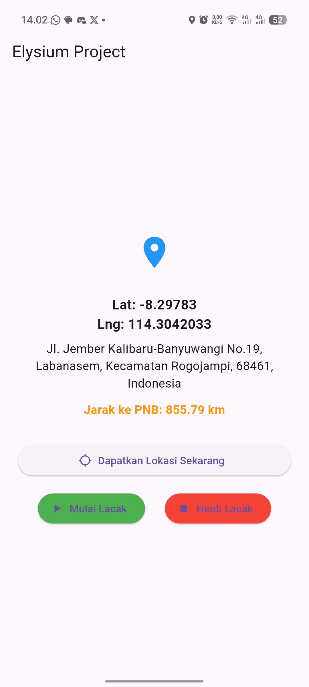

# Praktikum Mobile: Implementasi Geocoding pada Flutter

## Overview Aplikasi Geolocation dengan Geocoding

> **Identitas**  
> Nama:  M. Hilmi Zamzami
> NIM: 362458302071
> Kelas: TRPL 2B  
> Mata Kuliah: Pemrograman Mobile

## Deskripsi Tugas

Aplikasi ini merupakan pengembangan dari praktikum geolocation dasar dengan menambahkan fitur geocoding untuk mengkonversi koordinat GPS menjadi alamat yang mudah dibaca. Implementasi ini memenuhi persyaratan tugas untuk menambahkan fungsionalitas reverse geocoding pada aplikasi pelacakan lokasi.

## Fitur Utama

1. **Lokasi Real-time**
   - Mendapatkan koordinat GPS (latitude/longitude)
   - Pembaruan lokasi secara real-time
   - Penanganan izin lokasi secara otomatis

2. **Geocoding**
   - Konversi otomatis dari koordinat ke alamat
   - Menampilkan informasi lokasi lengkap:
     - Nama jalan
     - Area/Kecamatan
     - Kota
     - Kode pos
     - Negara
   - Update alamat otomatis saat lokasi berubah

3. **Jarak Real-time ke Titik Tetap (Fitur Terbaru)**
   - Menghitung jarak real-time ke titik referensi PNB
   - Koordinat PNB: Lat: -6.2088, Lng: 106.8456
   - Update jarak otomatis saat pengguna bergerak
   - Format jarak dalam kilometer dengan 2 desimal
   - Tampilan jarak real-time di UI dengan styling khusus

4. **Kontrol Tracking**
   - Tombol untuk mendapatkan lokasi saat ini
   - Fitur mulai/henti pelacakan lokasi
   - Tampilan error yang informatif

## Implementasi

### Paket yang Digunakan

```yaml
dependencies:
  geolocator: ^14.0.2  # Untuk mendapatkan koordinat GPS
  geocoding: ^2.1.6    # Untuk konversi koordinat ke alamat
```

### Struktur Kode

1. **State Management**
```dart
Position? _currentPosition;   // Koordinat GPS
String? _currentAddress;      // Hasil geocoding
String? _distanceToPNB;       // Jarak ke titik tetap PNB
String? _errorMessage;        // Pesan error
StreamSubscription<Position>? _positionStream;  // Untuk tracking

// Titik tetap PNB (koordinat referensi) 
static const double _pnbLatitude = -6.2088;
static const double _pnbLongitude = 106.8456;
```

2. **Fungsi Geocoding**
```dart
Future<void> getAddressFromLatLng(Position position) async {
  try {
    // Konversi koordinat ke alamat
    List<Placemark> placemarks = await placemarkFromCoordinates(
      position.latitude,
      position.longitude,
    );

    // Ambil data alamat pertama
    Placemark place = placemarks[0];
    setState(() {
      _currentAddress =
          '${place.street}, ${place.subLocality}, ${place.locality}, ${place.postalCode}, ${place.country}';
    });
  } catch (e) {
    setState(() {
      _currentAddress = null;
      _errorMessage = 'Gagal mendapatkan alamat: ${e.toString()}';
    });
  }
}
```

3. **Fungsi Perhitungan Jarak Real-time (Fitur Baru)**
```dart
// Di dalam _handleStartTracking() - dalam .listen()
void _handleStartTracking() {
  _positionStream?.cancel();

  final LocationSettings locationSettings = LocationSettings(
    accuracy: LocationAccuracy.high,
    distanceFilter: 5, // Update setiap pergerakan 5 meter
  );

  try {
    _positionStream =
        Geolocator.getPositionStream(
          locationSettings: locationSettings,
        ).listen((Position position) async {
          // Hitung jarak ke titik tetap PNB - FITUR BARU
          double distanceInMeters = await Geolocator.distanceBetween(
            position.latitude,
            position.longitude,
            _pnbLatitude,
            _pnbLongitude,
          );
          
          setState(() {
            _currentPosition = position;
            _errorMessage = null;
            // Format jarak dalam kilometer (2 desimal)
            _distanceToPNB = '${(distanceInMeters / 1000).toStringAsFixed(2)} km';
          });
          
          await getAddressFromLatLng(position);
        });
  } catch (e) {
    setState(() {
      _errorMessage = e.toString();
    });
  }
}
```

## Screenshot dan Demo



## Penjelasan Implementasi

### Langkah-langkah Pengembangan

1. **Persiapan**
   - Menambahkan package geocoding di pubspec.yaml
   - Mengimport package yang diperlukan
   - Menambahkan variable state untuk alamat

2. **Implementasi Geocoding**
   - Membuat fungsi getAddressFromLatLng
   - Mengintegrasikan dengan sistem tracking yang ada
   - Menangani error dan exception

3. **Update UI**
   - Menambahkan tampilan untuk alamat
   - Mengatur layout dan styling
   - Implementasi loading state

### Perubahan Terbaru - Fitur Jarak Real-time ke Titik Tetap

#### Apa yang Diubah:

1. **Tambahan Variable State** (baris 35-39)
   - `String? _distanceToPNB;` - Menyimpan jarak real-time
   - `static const double _pnbLatitude = -6.2088;` - Latitude titik PNB
   - `static const double _pnbLongitude = 106.8456;` - Longitude titik PNB

2. **Update Fungsi `_handleStartTracking()`** (baris 123-161)
   - Menambahkan perhitungan jarak menggunakan `Geolocator.distanceBetween()`
   - Konversi hasil dari meter ke kilometer
   - Format dengan 2 angka desimal
   - Update state dengan hasil perhitungan

3. **Update UI** (baris 220-230)
   - Menambahkan widget Text untuk menampilkan jarak
   - Styling khusus dengan warna orange dan font bold
   - Conditional rendering: hanya tampil saat tracking aktif dan jarak sudah dihitung

#### Cara Kerja:
- Saat pengguna menekan tombol "Mulai Lacak", sistem akan menghitung jarak real-time
- Setiap kali lokasi berubah (lebih dari 5 meter), jarak ke titik PNB akan dihitung ulang
- Jarak ditampilkan di UI dalam format "X.XX km"
- Update berhenti saat pengguna menekan "Henti Lacak"

### Challenges & Solutions

1. **Penanganan Error**
   - Implementasi try-catch untuk geocoding
   - Menampilkan pesan error yang informatif
   - Graceful fallback saat geocoding gagal

2. **Optimasi Performa**
   - Penggunaan setState yang efisien
   - Pembatalan subscription saat dispose
   - Penanganan state loading

## Cara Menjalankan

1. Clone repository ini
2. Install dependencies:
   ```bash
   flutter pub get
   ```
3. Jalankan aplikasi:
   ```bash
   flutter run
   ```